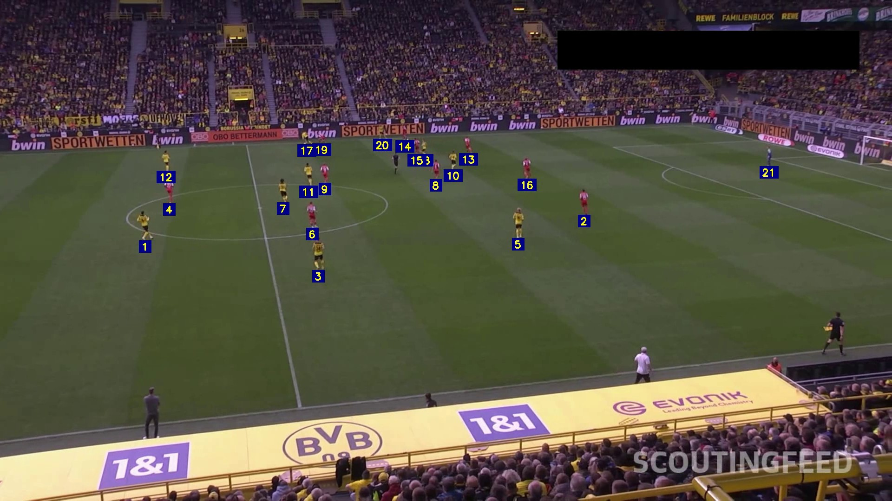
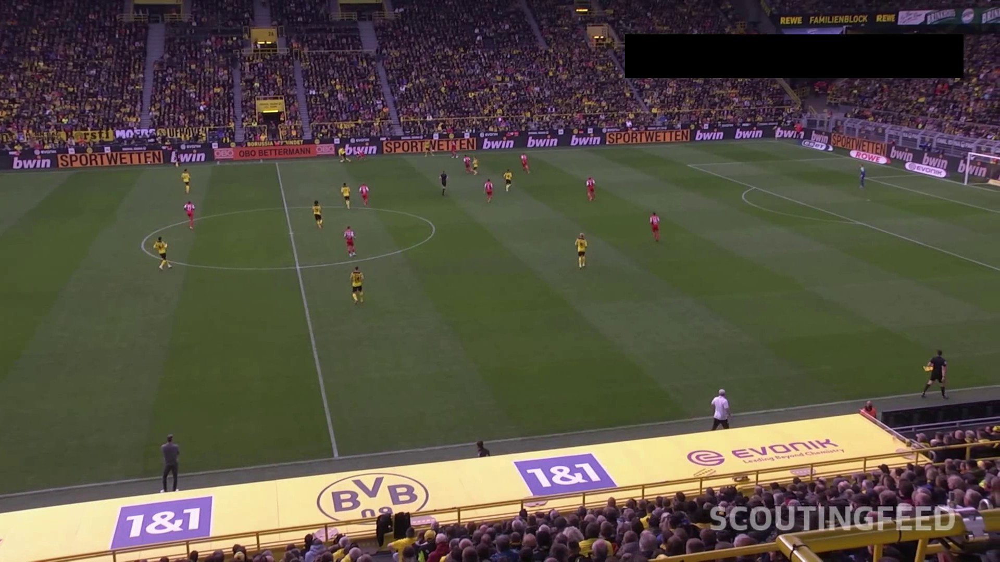
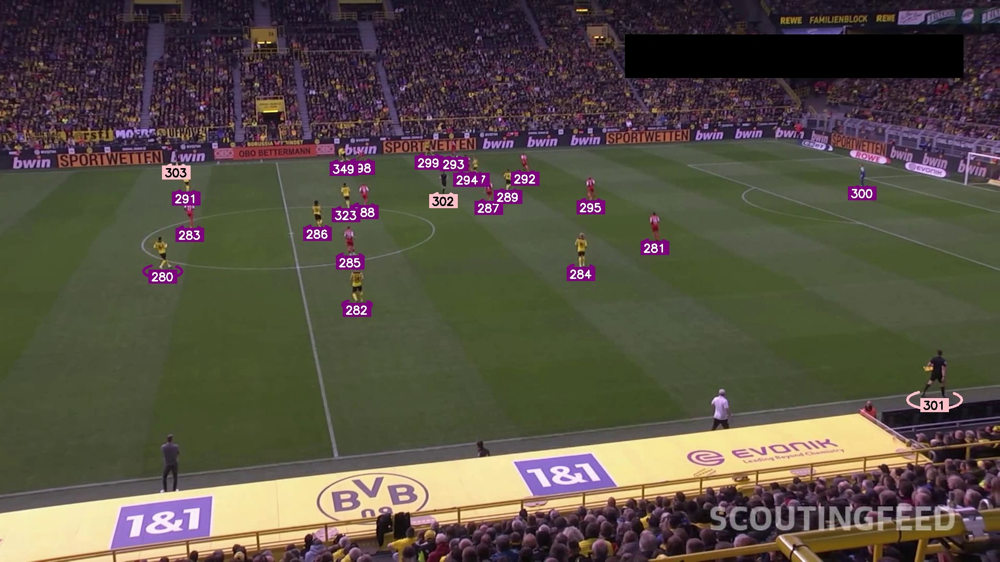

# Football Tracking

End-to-end football (soccer) video analysis — player/ball detection, multi-object tracking, possession detection, and interactive segmentation — running on GPU.


---

## Features

- **Player & ball detection** using a custom-trained YOLOv5 model (4 classes: ball, goalkeeper, player, referee)
- **Multi-object tracking** with ByteTrack, giving each player a consistent ID across frames
- **Ball possession detection** based on player-ball proximity
- **Annotated video export** with per-class colour coding and tracker-ID labels
- **Interactive segmentation & tracking** via Track-Anything (SAM + XMem) with a Gradio UI

---

## Demo

### Pipeline 1 — Player & Goalkeeper Tracking

<video src="players_detection.mp4" controls width="100%"></video>

### Pipeline 2 — Ball Tracking & Possession Detection

<video src="ball_tracking.mp4" controls width="100%"></video>

### Pipeline 3 — Full Integration

<video src="players_ball_tracking.mp4" controls width="100%"></video>

---

## Project Structure

```
football-tracking/
├── football_tracking.ipynb     # Main detection + tracking pipeline (3 pipelines)
├── track_anything.ipynb        # Interactive segmentation & tracking via Gradio
├── tracking_football/          # YOLOv5 weights, ByteTrack, sample videos
├── Track-Anything/             # SAM + XMem + E2FGVI source code
├── yolo_tracking/              # BoxMOT — advanced multi-object tracking modules
├── players_detection.mp4       # Sample output — players with tracker IDs
├── ball_tracking.mp4           # Sample output — ball + possession markers
└── players_ball_tracking.mp4   # Sample output — full combined pipeline
```

---

## Prerequisites

- Python 3.8+
- CUDA 12.x — tested on NVIDIA A100 80 GB
- PyTorch 2.2.1+ with matching `torchvision`

---

## Notebooks

### 1. `football_tracking.ipynb` — Detection & Tracking Pipeline

Runs three progressive pipelines on a football match video.

**Setup**

```bash
cd tracking_football/notebooks/yolov5
pip install -r requirements.txt

cd ../ByteTrack
pip install -r requirements.txt
python setup.py develop
pip install cython_bbox onemetric
```

**Custom model weights**

Place the fine-tuned YOLOv5 weights at:

```
tracking_football/notebooks/yolov5/best.pt
```

**Pipelines**

| Pipeline | Output file | What it does |
|----------|-------------|--------------|
| 1 — Player tracking | `players_detection.mp4` | Detects players + goalkeepers, assigns ByteTrack IDs, draws ellipses + ID labels |
| 2 — Ball & possession | `ball_tracking.mp4` | Adds ball detection and a proximity-based possession marker above the player in possession |
| 3 — Full integration | `players_ball_tracking.mp4` | Combines all classes (players, goalkeepers, referees, ball) with colour-coded ellipses, tracker IDs, and possession marker |

**Key parameters**

| Parameter | Value |
|-----------|-------|
| YOLO confidence threshold | 0.25 |
| Input resolution | 1280 px |
| Output resolution | 1920 × 1080 @ 30 fps |
| Possession proximity threshold | 30 px |
| ByteTrack `track_buffer` | 30 frames |

**Class colour scheme**

| Class | Colour |
|-------|--------|
| Ball | Blue `#0000FF` |
| Goalkeeper | Orange `#FFA500` |
| Player | Purple `#800080` |
| Referee | Pink `#FFC0CB` |

---

### 2. `track_anything.ipynb` — Interactive Segmentation & Tracking

Launches a Gradio web app where you click on any object in the first frame and the model tracks it through the entire video.

**Setup**

```bash
cd Track-Anything
pip install -r requirements.txt
```

Download the SAM checkpoint and place it in `Track-Anything/checkpoints/`:

```bash
wget https://dl.fbaipublicfiles.com/segment_anything/sam_vit_h_4b8939.pth \
     -P Track-Anything/checkpoints/
```

XMem weights are downloaded automatically on first run.

**Run**

```bash
# Standard (ViT-H SAM — most accurate)
python app.py --device cuda:0

# Lighter (ViT-B SAM — lower VRAM)
python app.py --device cuda:0 --sam_model_type vit_b
```

Or run the notebook cell `!python app.py --device cuda:0` directly.

The app starts at `http://127.0.0.1:7860` and prints a public 72-hour share link.

**Workflow in the UI**

1. Upload a video
2. Click the object you want to track in the displayed first frame
3. Click **Track** — SAM segments it, XMem tracks it through every frame
4. Optionally enable **Inpainting** (E2FGVI) to remove the tracked object
5. Download the output video

---

## Tech Stack

| Component | Library / Model |
|-----------|----------------|
| Object detection | YOLOv5 (custom-trained `best.pt`) |
| Multi-object tracking | ByteTrack, BoxMOT |
| Interactive segmentation | Segment Anything (SAM ViT-H / ViT-B) |
| Video object tracking | XMem |
| Video inpainting | E2FGVI |
| Gradio UI | Gradio 3.39 |
| Computer vision | OpenCV 4.8 |
| ML framework | PyTorch 2.2+ |
